[linkedin](https://www.linkedin.com/in/sacha-s-a769b73b4/) &nbsp;·&nbsp;
[email](mailto:clb@sservant@student.42lyon.fr) &nbsp;·&nbsp;
[discord](https://discord.gg/9TSgWRNqXZ) &nbsp;·&nbsp;
[42](https://profile.intra.42.fr/users/sservant)

